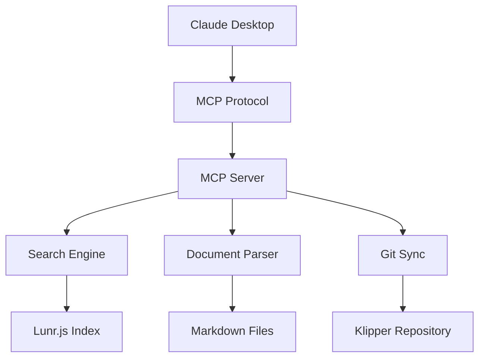

# 🖨️ MCP Klipper Documentation Server

<div align="center">

[](https://badge.fury.io/js/mcp-klipper-docs)
[](https://opensource.org/licenses/MIT)
[](https://www.typescriptlang.org/)
[](https://nodejs.org/)
[](https://modelcontextprotocol.io/)

**AI-Powered Klipper Documentation at Your Fingertips**

A Model Context Protocol (MCP) server that transforms how you interact with Klipper 3D printer firmware documentation.

[🚀 Quick Start](#-quick-start) • [📖 Documentation](#-documentation) • [🔧 Configuration](#-configuration) • [🤝 Contributing](#-contributing)

</div>

---

## 🖼️ See It In Action


*Experience seamless Klipper documentation access directly within Claude Desktop. Search configurations, browse documentation, and get instant answers to your 3D printing questions.*

---

## 🎯 Why This Matters

Klipper's documentation is comprehensive but scattered across dozens of markdown files. Finding the right configuration option or troubleshooting guide means multiple clicks and searches. **This changes everything.**

### The Problem
- 🔍 **Fragmented Documentation**: 50+ separate markdown files
- 🐛 **Configuration Complexity**: Hard to find specific option details
- ⏱️ **Context Switching**: Jump between docs and your config files
- 🤖 **AI Limitations**: Claude can't access local Klipper docs

### The Solution
- 🔎 **Unified Search**: Search all documentation instantly
- ⚙️ **Smart Config Lookup**: Get exact configuration sections
- 📚 **Intelligent Browsing**: Navigate by logical categories
- 🤖 **AI Integration**: Claude becomes your Klipper expert

---

## 🚀 Quick Start

### Prerequisites

- **Node.js** >= 20.0.0
- **npm** or **yarn**
- **Claude Desktop** (for MCP integration)

### Installation

```bash
# Install globally
npm install -g mcp-klipper-docs

# Or install locally in your project
npm install mcp-klipper-docs
```

### Claude Desktop Setup

1. **Open your Claude Desktop config file**:
   - **Windows**: `%APPDATA%\Claude\claude_desktop_config.json`
   - **macOS**: `~/Library/Application Support/Claude/claude_desktop_config.json`

2. **Add the MCP server**:

```json
{
  "mcpServers": {
    "klipper-docs": {
      "command": "mcp-klipper-docs"
    }
  }
}
```

3. **Restart Claude Desktop**

That's it! 🎉 Claude now has instant access to all Klipper documentation.

---

## 🛠️ What Can You Do?

### 🔍 Search Documentation
```
"Search for BLTouch configuration"
"Find information about pressure advance"
"Look up extruder tuning guides"
```

### ⚙️ Get Configuration Details
```
"Get configuration for [extruder]"
"Show me stepper_x settings"
"What are the bed_mesh parameters?"
```

### 📚 Browse by Section
```
"Browse calibration documentation"
"Show me hardware configuration sections"
"What's in the troubleshooting section?"
```

### 📊 Get Statistics
```
"How many documents are available?"
"What sections exist in the documentation?"
"Show me index statistics"
```

---

## 🏗️ Architecture

### Core Components



### Technology Stack

| Component | Technology | Purpose |
|-----------|------------|---------|
| **Runtime** | Node.js 20+ | JavaScript execution |
| **Language** | TypeScript 5.3+ | Type safety & development |
| **Protocol** | MCP SDK 1.0+ | Claude Desktop integration |
| **Search** | Lunr.js 2.3+ | Full-text search indexing |
| **Git** | simple-git 3.22+ | Repository synchronization |
| **Parsing** | marked 11.1+ | Markdown processing |
| **Metadata** | gray-matter 4.0+ | Frontmatter extraction |

### Data Flow

1. **Repository Sync**: Automatically pulls latest Klipper documentation
2. **Document Parsing**: Extracts content, metadata, and structure
3. **Index Building**: Creates searchable lunr.js index
4. **MCP Integration**: Exposes tools and resources via MCP protocol
5. **AI Interaction**: Claude searches and retrieves documentation

---

## 📋 Available Tools

### 🔎 `search_klipper_docs`
Search across all Klipper documentation with relevance scoring.

**Parameters**:
- `query` (string): Search terms
- `limit` (number, optional): Max results (default: 10)
- `section` (string, optional): Filter by section

**Example**:
```json
{
  "query": "BLTouch configuration",
  "limit": 5,
  "section": "hardware"
}
```

### ⚙️ `get_config_option`
Retrieve specific configuration sections from Config_Reference.

**Parameters**:
- `option` (string): Configuration option name
- `include_examples` (boolean, optional): Include code examples

**Example**:
```json
{
  "option": "extruder",
  "include_examples": true
}
```

### 📚 `browse_documentation`
Browse documentation by section or get overview information.

**Parameters**:
- `section` (string, optional): Section to browse
- `include_stats` (boolean, optional): Include statistics

**Example**:
```json
{
  "section": "calibration",
  "include_stats": true
}
```

### 📊 `get_index_stats`
Get documentation index statistics and metadata.

**No parameters required.**

---

## 📁 MCP Resources

All documentation files are available as MCP resources:

- **URI Scheme**: `klipper://docs/{document-id}`
- **Format**: Markdown with metadata
- **Access**: Direct file reading or browsing

**Example Resources**:
- `klipper://docs/Config_Reference`
- `klipper://docs/BLTouch`
- `klipper://docs/Installation`
- `klipper://docs/Troubleshooting`

---

## 🔧 Advanced Configuration

### Environment Variables

| Variable | Default | Description |
|----------|---------|-------------|
| `GIT_REPOSITORY` | `https://github.com/Klipper3d/klipper.git` | Klipper repository URL |
| `GIT_BRANCH` | `master` | Repository branch |
| `DATA_DIR` | `./data` | Local data directory |
| `LOG_LEVEL` | `info` | Logging level (debug, info, warn, error) |
| `UPDATE_INTERVAL` | `3600` | Auto-update interval in seconds |

### Docker Deployment

```bash
# Build the image
docker build -t mcp-klipper-docs .

# Run the container
docker run -d \
  --name mcp-klipper-docs \
  -v $(pwd)/data:/app/data \
  mcp-klipper-docs
```

### Docker Compose

```yaml
version: '3.8'
services:
  mcp-klipper-docs:
    build: .
    container_name: mcp-klipper-docs
    volumes:
      - ./data:/app/data
    environment:
      - LOG_LEVEL=info
      - UPDATE_INTERVAL=3600
    restart: unless-stopped
```

---

## 📊 Performance Metrics

### Index Statistics
- **Documents**: 56 Klipper documentation files
- **Words**: 135,000+ indexed words
- **Sections**: 11 categorized sections
- **Build Time**: ~400ms for full index
- **Search Speed**: <10ms for typical queries

### Memory Usage
- **Base Memory**: ~50MB
- **Index Memory**: ~25MB
- **Peak Memory**: ~100MB during updates

### Network Usage
- **Initial Clone**: ~50MB (one-time)
- **Updates**: ~1-5MB (changes only)
- **API Calls**: Local only (no external dependencies)

---

## 🧪 Development

### Local Development Setup

```bash
# Clone the repository
git clone https://github.com/yourusername/mcp-klipper-docs.git
cd mcp-klipper-docs

# Install dependencies
npm install

# Run in development mode
npm run dev

# Run tests
npm test

# Build for production
npm run build
```

### Project Structure

```
mcp-klipper-docs/
├── src/
│   ├── server.ts          # Main MCP server
│   ├── config.ts          # Configuration management
│   ├── logger.ts          # Logging utilities
│   ├── git-sync.ts        # Git repository operations
│   ├── parser.ts          # Markdown document parsing
│   ├── search.ts          # Search engine implementation
│   ├── types.ts           # TypeScript type definitions
│   └── errors.ts          # Error handling
├── tests/                 # Test suite
├── docs/                  # Additional documentation
├── img/                   # Images and assets
├── data/                  # Local Klipper repository
└── dist/                  # Built JavaScript files
```

### Testing

```bash
# Run all tests
npm test

# Run tests in watch mode
npm run test:watch

# Run with coverage
npm run test -- --coverage

# Lint code
npm run lint

# Fix linting issues
npm run lint:fix
```

---

## 🤝 Contributing

We welcome contributions from the Klipper community! Here's how you can help:

### 🐛 Reporting Issues

1. **Check existing issues** first
2. **Use the issue templates** provided
3. **Include**: 
   - Steps to reproduce
   - Expected vs actual behavior
   - Environment details
   - Relevant logs

### 💡 Feature Requests

1. **Open a discussion** first for major features
2. **Provide clear use cases**
3. **Consider implementation complexity**
4. **Think about edge cases**

### 🔧 Code Contributions

1. **Fork the repository**
2. **Create a feature branch**: `git checkout -b feature/amazing-feature`
3. **Make your changes**:
   - Follow existing code style
   - Add tests for new functionality
   - Update documentation
4. **Run the test suite**: `npm test`
5. **Submit a pull request**

### 📝 Documentation

- **Fix typos** and improve clarity
- **Add examples** and use cases
- **Update README** and guides
- **Translate** documentation (if you speak other languages)

---

## 📈 Roadmap

### Version 1.1 (Planned)
- [ ] **Enhanced Search**: Fuzzy matching and spell correction
- [ ] **Cross-references**: Link related configuration options
- [ ] **Version Support**: Support multiple Klipper versions
- [ ] **Performance**: Optimized indexing and caching

### Long-term Vision
- [ ] **Multi-language**: Internationalization support
- [ ] **Community Docs**: User-contributed documentation
- [ ] **AI Features**: Smart recommendations and assistance
- [ ] **Integration**: Other AI assistant platforms

---

## 🙏 Acknowledgments

### Core Technologies
- **[Model Context Protocol](https://modelcontextprotocol.io/)** - For enabling AI assistant integration
- **[Klipper](https://www.klipper3d.org/)** - For the excellent 3D printer firmware
- **[Lunr.js](https://lunrjs.com/)** - For powerful search capabilities
- **[TypeScript](https://www.typescriptlang.org/)** - For type-safe development

### Community
- **Klipper Community** - For maintaining comprehensive documentation
- **MCP Community** - For protocol development and support
- **Open Source Contributors** - For the tools and libraries we use

---

## 📄 License

This project is licensed under the MIT License - see the [LICENSE](LICENSE) file for details.

---

## 📞 Support & Community

### Get Help
- **📖 Documentation**: Check this README and the `/docs` folder
- **🐛 Issues**: [Report bugs on GitHub](https://github.com/yourusername/mcp-klipper-docs/issues)
- **💬 Discussions**: [Join GitHub Discussions](https://github.com/yourusername/mcp-klipper-docs/discussions)

### Community
- **Discord**: Join the Klipper and MCP communities
- **Reddit**: r/klipper and r/3Dprinting
- **Twitter/X**: Follow @klipper3d and MCP updates

---

<div align="center">

**⭐ If this project helps you, consider giving it a star!**

Made with ❤️ by the 3D printing community, for the 3D printing community.

[🔝 Back to top](#-mcp-klipper-documentation-server)

</div>
